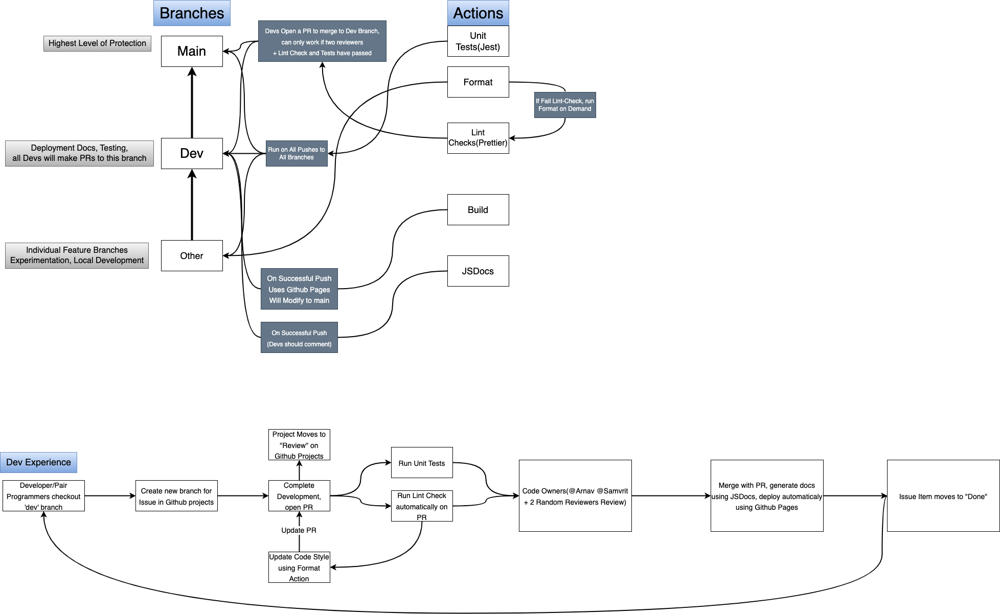
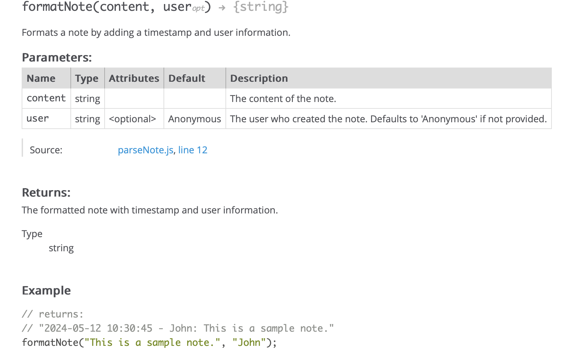
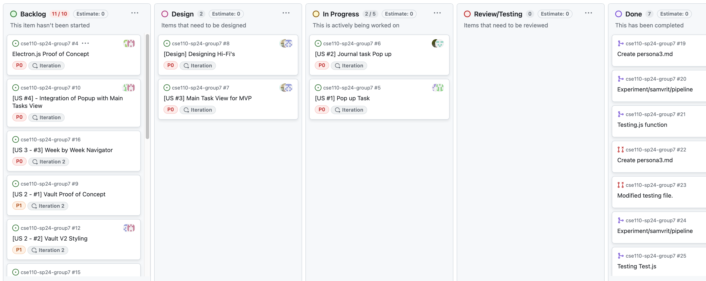
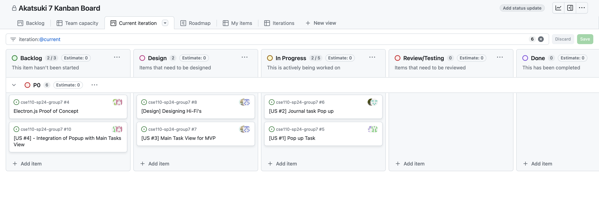
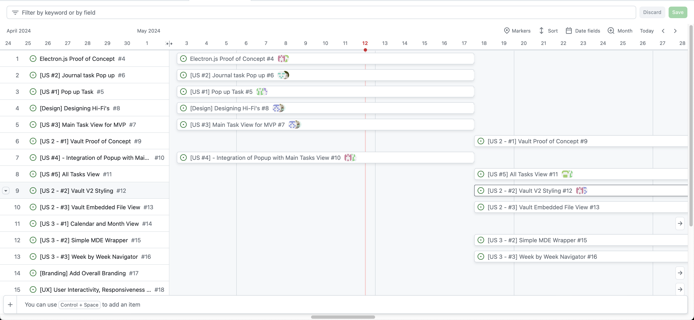

# CI/CD Pipeline - Phase 1

## Introduction

This document describes the first phase of the CI/CD pipeline for the project. Our approach was to focus primarily on the continuous integration and testing aspects of the pipeline.

Our approach can be defined into two different approaches, what occurs on the cloud and what occurs on the local machine.

## Local Machine

All branches are forked from `dev` and are merged back into `dev` once the feature is complete. The `dev` branch is then merged into `main` once the sprint is complete and we have conducted a code review, E2E and integration testing, and comphrehensively documented and commented our code.

Once a developer has branched from `dev`, using a naming convention of `feature/owner+owner2/desc`, they are expected to conduct all development on their local machine. After this, they are expected to push to their branch and open a PR with `dev` as the base. Prior to making a PR, a **developer** is expected to:

1. Conduct unit testing on their code
2. Comment their code according to JSDoc standards
3. Ensure that their code is properly formatted(using prettier + eslint)
4. Use `git pull origin dev` and `git pull origin main` to ensure that their branch is up to date with the latest changes and can be merged without conflicts
5. Ensure that their code is properly documented and that the PR is descriptive and informative (see [DevDocs](../../source/project/docs/DevDocs) folder for more information)

On the cloud we offer protection for both the main and dev branches to ensure that no code is merged without proper testing. The only people that can override this are the project owners(@Arnav, @Samvrit) to bypass any issues that may arise.

## Cloud

Our cloud component can be broken up into a variety of different components. Our CI/CD diagram is listed as:

## Branches

We want to protect the `main` branch as much as possible. So all developmental efforts are based from and merged back into the `dev` branch. Only admininistrative documents are merged directly into the `main` branch. This offers a layer of protection to ensure that the `main` branch is always stable and deployable(CI/CD philosophies similar to Agile). All **Pull Requests** are based and merged into the `dev` branch.

### Branch Protection + PRs

We have branch protection rules in place to ensure that no code is merged without proper testing. Status checks and reviews are required to ensure that the code is properly tested and reviewed. On top of the code owners, we the team leads will randomly assign two other developers to review, test and approve the code. This will cycle for each PR and only once linting, testing is complete, then the PR can be merged into the `dev` branch.

### Testing

We will be using **Jest** for our unit testing, and will be exploring **E2E** testing frameworks in the future. The JEST environemnt is fully configurable and ready for use as we currently have a `__tests__` folder that contains all of our unit tests. Each script or `.js` file in our `components` folder will have a corresponding test file in the `__tests__` folder. Developers are expected to come up with their own test cases and other reviewers can also come up with their own test cases. The Jest environment is also saved locally as a Dev dependency and can be run using `npm run test` to run the entire test suite. The Action will also run the test suite on **every** push to a branch to ensure that functionality is not broken upon making changes. Even on PRs, the test suite will run to ensure that the code is properly tested before being merged.

### Linting

#### Prettier

We are using Prettier to ensure that our code is properly formatted. Although we had other options(see ADR regarding Prettier), we decided to utilize Prettier due to its integration with ESLint and its ease of use. Using `npm run format` will format the entire codebase in `source/project` and all the `spec` files that we create. Likewise, the Action will also run this script after the tests are run to ensure common styling in the dev branch before a future developer bases their work off of it. We will be using the default Prettier configuration for now, but we may change this in the future to better suit the team needs.

#### ESLint

**This Action is not configured yet, but will be in the future.** Since our work heavily relies on Javascript for key functionality, we will be using ESLint to ensure that our code is properly linted. While we have not explored possible configurations, other orgs that our developers are in have used ESLint to ensure best practices and common styling. We will be using the default ESLint configuration for now, but we may change this in the future to better suit the team needs.

Our plan for implementation is to have this be a check for the PRs to ensure non-buggy, standardized code is being merged into the `dev` branch. We have a disabled action in [Lint-check](../../.github/workflows/lint-check.yml) that will be enabled in the future. The ESLint Action will be heavily based off of the action described here.

### Documentation - JSDoc

We are using JSDoc to ensure that our code is properly documented. While there were other frameworks like Mocha, we decided to use JSDoc due to its similarity in deploying an html page with the documentation, as well as being relatively lightweight and user-friendly.

Shown below is an example of the type of documentation that we can expect from our developers, and also by adhering to a single commenting standard, we can ensure that our documentation is consistent and easy to read.

We have an action that is tied with our deployment to generate and build new documentation for the project upon **pushing** to dev, this either occurs when the project owners modify the `dev` branch and/or the documentation or when a `PR` is merged into the `dev` branch. This consistently updates the current documentation and ensures that the project that we can demo has the latest documentation.

In tandem with our deployment, our documentation is accessible via this link: [Documentation](https://cse110-sp24-group7.github.io/cse110-sp24-group7/source/project/docs/JSDocs/global.html) (_Note: This link may be subject to change in the future and is deployed on the cloud_)

### Deployment

We are using GitHub Pages to deploy our website. This is currently still an **in-progress effort** as we aim to figure out the best way to package, deploy and deliver our project. Currently as we are dealing with semi-static html pages with styling, Github Pages in tandem with **Jekyll** is the most readily available option to deploy and host our project. As we work on hashing out **Electron.js** and packaging our app/defining our Schemas, we may lend to using other deployment strategies. For right now, this gives us a baseline environment to view our project on Browsers and Mobile devices.

### Github Projects and Workflow

We have also lended to automating our workflow using Github Projects. We tried using tools like **Trello** but were capped by the 10-person limit. We have since moved to using Github Projects to manage our workflow and have found it to be a very useful tool with its seamless integration to Pull Requests and Issues. We have a `Backlog`, `Design`, `In Progress`, `Review/Testing` and `Done` column to manage our workflow. We have also added iterations and clearly documented Issues corresponding to Frontend and Backend work for each issue and assigned Developers to each task in either pairs or teams of 3. When new issues are created they are automatically added to the `Backlog` column and a Developer can then move it to the `Design` or `In Progress` column when they are ready to work on it. When a PR is opened and the code is ready for review, the issue is moved to the `Review/Testing` column and then to the `Done` column when the PR is merged. This can all be done without going to the Github Projects page and can be done directly from the PR page.

Some affiliated Images: 

### Conclusion

We thank you for the opportunity to present our V1 of our CI/CD pipeline. We have made significant progress in the past few weeks and have a solid foundation to build upon. Looking forward we aim to optimize our linting process, integrate **E2E** testing, and further explore deployment strategies. 