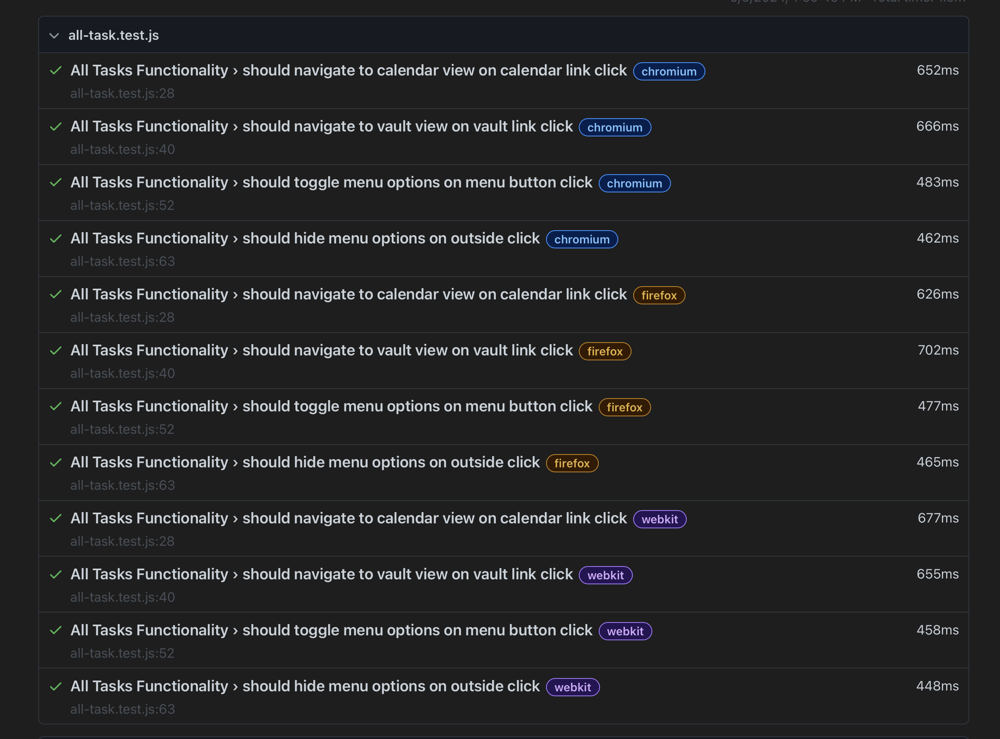
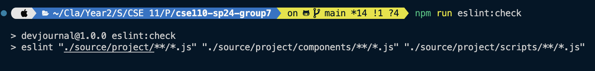
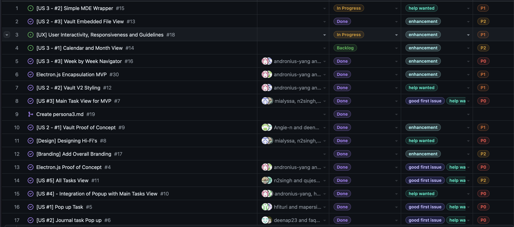

# CI/CD Pipeline - Phase 2

## Introduction

This document describes the second phase of the CI/CD pipeline for the project. Our approach was to focus primarily on the continuous deployment and delivery aspects of the pipeline.

Our approach can be defined into two different approaches, what occurs on the cloud and what occurs on the local machine.

## Local Machine

On top of the scripts that we defined in Phase 1, we have added a few more scripts, namely all the scripts associated with `eslint` and `electron`, `electron-forge` for consolidating Javascript standards as well as electron dependencies for testing. We revised our actions to combine the linting and standard-fixing scripts into one action, and we have a local script to run **Playwright** E2E Tests. 

## Branching

No change from last phase: All branches are forked from `dev` and are merged back into `dev` once the feature is complete. The `dev` branch is then merged into `main` once the sprint is complete and we have conducted a code review, E2E and integration testing, and comphrehensively documented and commented our code. In the conclusion of our project, was the last time we merged dev into main and deployed our project to the world. 

We continued to use the conslidated naming conventions of `feature/owner+owner2/desc` for our branches, this helped us easily checkout branches and merge branches since with our daily standup meetings, we knew which developers were working on which features. This helped us to easily identify who was working on what and what needed to be done.

## DX

As usual, a user would use `git checkout -b feature/owner+owner2/desc` to create a new branch, and then use `git push origin feature/owner+owner2/desc` to push the branch to the remote repository. The base of this branch would be `dev` and all Pull Requests would target the `dev` branch until the final release of the project. Developers had also the freedom/capability to merge other branches into their own branches to ensure that their code was up to date with the latest changes. 

Developers were also expected to resolve merge conflicts on their own branch prior to making a PR using `git pull origin dev` and `git pull origin main` to ensure that their branch was up to date with the latest changes.

As such a high level workflow would be as follows:
1. Create a new branch using `git checkout -b feature/owner+owner2/desc`
2. Push the branch to the remote repository using `git push origin feature/owner+owner2/desc`
3. Make changes to the codebase
4. Resolve merge conflicts using `git pull origin dev` and `git pull origin main`
5. Run unit tests using `npm run test:unit`
6. Run E2E tests using `npm run test:E2E`
7. Run checks using `npm run eslint:check` and `npm run prettier:check`
8. Fix any issues using `npm run eslint:fix` and `npm run prettier:fix`
9. Push any styling changes to the repository
10. Ping and assign reviewers to the PR (Team Leads + 2 random developers)
11. Merge the PR into the `dev` branch

## Protection + Rulesets

Although we leveraged using Rulesets in the first part of our project, we did not have any rulesets in place for the second part of our project on `dev`. Due to adding `JSDocs` we had to ensure that the Github Actions could have push access to the `dev` branch to update the documentation without needing a Pull Request. Thus, it became adopted **Team Practice** to ensure that the `dev` branch was protected and Pull Requests need to pass status checks before being merged as well as be reviewed by team leads and 2 random developers. Main still had this protections but this leads to actions failing on occasion(we are still researching ways to fix this). 

## Testing

In Phase 1, we mentioned that we use Jest to Unit Test our code. We removed all of the sanity tests that were placed to demonstrate the Github Action and the job, and focused more on End to End Testing using **Playwright**. We have a script that runs the Playwright tests located in our `package.json` file called `test:E2E`. We have scripts for each view that interface with a users file system and tests the launchability of the application. 

Initially our V1 of E2E tests was statically testing the components using **Jest-puppeteer** but we found that this was not as effective as we wanted it to be. We then moved to **Playwright** which was more effective in testing the PWA as a whole and we could emulate user behavior much better. We could also test on different browsers: \[Chromium, Firefox, Webkit\] and modularize our test suite to test individual views and assess *cross-compatability* across different pages. 

## Linting

In Phase 1, we only had prettier working and configurable and even then, it was not fully accurate. In Phase 2: We have added `eslint` to our project to ensure that our code is properly linted. Consolidating to our `Electron` configuration we obeyed the `ES6` standards and modularized our codebase(albeit without using `.mjs` files). We have a script that runs the eslint checks located in our `package.json` file called `eslint:check`. We also have a script that fixes the issues located in our `package.json` file called `eslint:fix` if possible. If you see the current status of our codebase, we have changed the `eslint` configuration to be more strict and to ensure that our codebase obeyes the same styling across branches and components. 

## Building

This is one thing that we intended to work on, is to configure Github Actions to use `Electron-forge` to automatically package and deploy releases on the cloud, and this would be one thing that would bolster the quality of our CI/CD Pipeline. However, Github Actions has difficulty with their runners supporting files of such large sizes, and we ran into many issues either hosting Browsers or storing artifacts of that size on the runner's storage/Memory, as many times the actions themselves would crash. 

As a result, we have our scripts on local where: 
1. `npm start` would deploy an in-house browser window with access to `Userdata/`
2. `npm run package` would prep the project to be packaged prior to distribution
3. `npm run make` would create these distributables for a specified OS of the developer. We consolidated devs who had both styles of machines and asked them to provide installers for Github Releases. 

## JSDoc and Hosting

All of our admin Documentation is deployed to [cse110-sp24-group7.github.io/cse110-sp24-group7](https://cse110-sp24-group7.github.io/cse110-sp24-group7/) and our Documentation is hosted via this link: [Docs](https://cse110-sp24-group7.github.io/cse110-sp24-group7/source/project/docs/JSDocs/index.html), and is dynamically generated and built on any push to `dev` and `main`. 

## Github Projects

Our Github Projects Pipeline hasn't changed, one thing that we did notice was that we aimed to have a majority of the issues done by the end of the project, leaving little to no backlog for future developers. We have achieved all but 3 of the 20 or so issues that we came up with at the beginning of the quarter. 

