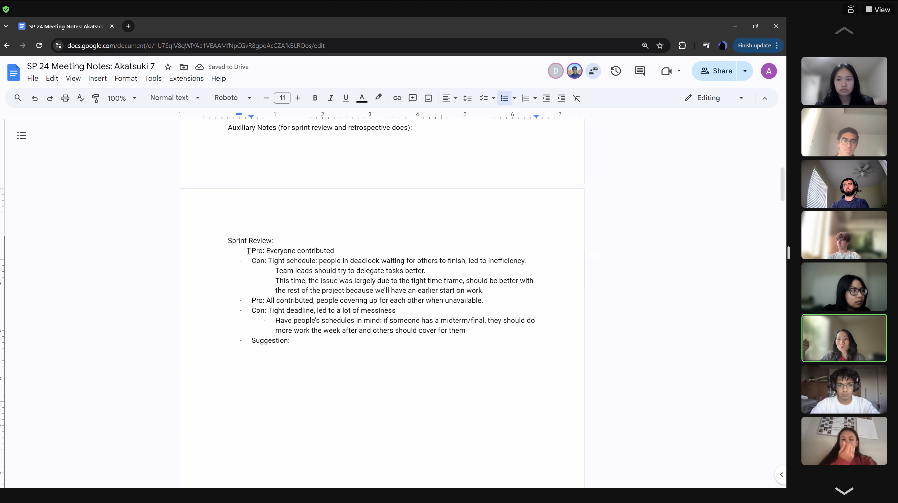
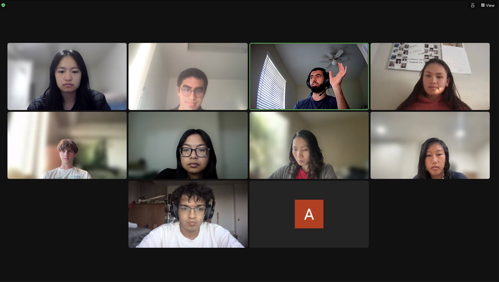

# Sprint 1 Review Meeting

### Attendees:

Arnav, Samvrit, Andrew, Angie, Deena, Emma, Hashim, Jessica, Matteo, Mialyssa, Naina

### Purpose of the Sprint Review

Today's Sprint Review was held to go over the first sprint that our team has had, namely in the creation of a sentiment rating widget. We held this review because we were interested in knowing what each team member was proud of personally, as well as to note some important group accomplishments. Being part of a team, it is often easy to forget to commend others on their work and focus on accomplishments, as we get lost in the minutiae and deadlines of the work.

### High Points of the Meeting

Following is feedback received from each member of the team, discussed at length in the Sprint Review Meeting:

- **Andrew**:
  - Team accomplishment: Glad that everyone on the team contributed and no one had to carry the workload.
  - Individual accomplishment: Proud of integration step, first time working in team development environment.
- **Angie**:
  - Team accomplishment: Good division of labor, clear definitions of what was expected.
  - Individual accomplishment: Proud of overall progress made on product.
- **Deena**:
  - Team accomplishment: Happy that people helped each other out a lot, filling in gaps of knowledge for each other.
  - Individual accomplishment: Proud of learning JS on short notice and in a quick time frame
- **Emma**:
  - Team accomplishment: Happy with how the product turned out and how everyone contributed.
  - Individual accomplishment: Proud of individual contributions to project.
- **Hashim**:
  - Team accomplishment: Impressed that all members of the team contributed, with people covering up for each other when unavailable.
  - Individual accomplishment: Proud of successful use of ChatGPT to provide information about an issue we were facing that wasn’t easily researchable.
- **Jessica**:
  - Team accomplishment: Flow, distribution of work was good. Issues were assigned clearly.
  - Individual accomplishment: Proud of the design process and how it evolved, and getting work done early.
- **Matteo**:
  - Team accomplishment: Team leads did a good job of assigning issues quickly.
  - Individual accomplishment: Proud of being able to work dedicatedly to the project despite having a midterm during the project's timespan.
- **Mialyssa**:
  - Team accomplishment: Flow of project went pretty well overall.
  - Individual accomplishment: Proud of overall progress made on UX of widget.
- **Naina**:
  - Team accomplishment: The way we split up tasks and went about assignments GitHub issues went well. Everyone completed their assigned work on time, reached out for help, and worked hard to get the widget completed on time and working well.
  - Individual accomplishment: Proud of being able to work with teammate on completing our assigned task, getting it working perfectly after struggling for several hours.
- **Arnav**:
  - Team accomplishment: Very impressed by the work delivered within the timeframe, and also on the overall design of the product.
  - Individual accomplishment: Proud of managing the team and issues effectively, and coming up with better documentation processes.
- **Samvrit**:
  - Team accomplishment: Proud of quick progress and how much work got done in the tight deadline. Everything was integrated and worked as intended well.
  - Individual accomplishment: Proud of getting issues out, setting up the project and coming up with new issues through the process.

### Overall Takeaways

The Sprint Review Meeting provided a comprehensive overview of the team's accomplishments and individual achievements during the sprint. Specifically, we highlight the team's **strong division of labor**, ensuring that everyone contributed meaningfully and no individual developer had an unmanageable workload. The team's **ability to learn new technologies on short notice** was particularly noteworthy, as well as the **adaptability** shown in maneuvering around sudden issues. Overall, the meeting indicated a **healthy team dynamic**, with developers supporting each other when necessary and working together cohesively. The meeting also emphasized to us the importance of **clear communication** and **effective task management**.

### Screenshots from Sprint Review:

