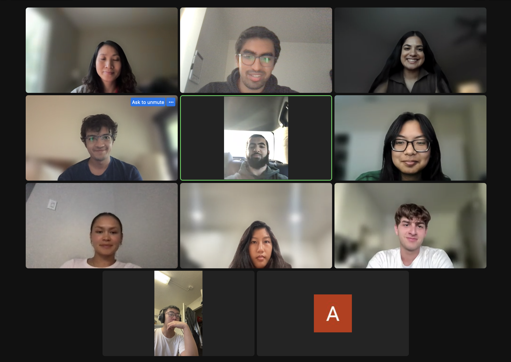
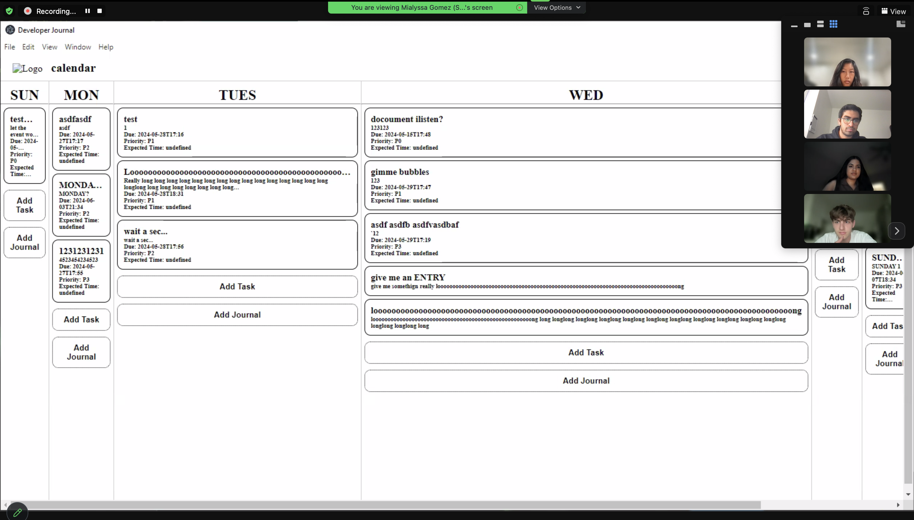
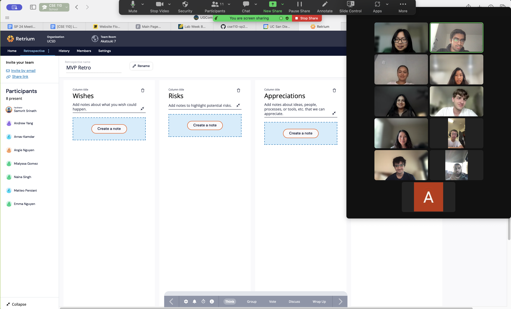
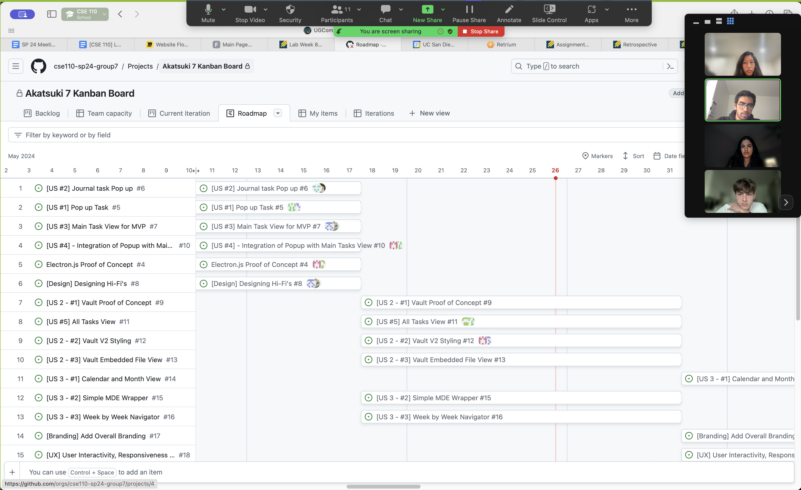
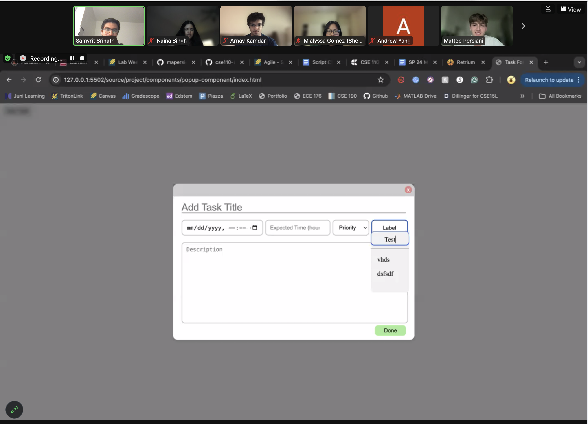

# Sprint 1 Review Meeting

### Attendees:

Arnav, Samvrit, Andrew, Angie, Deena, Emma, Hashim, Matteo, Mialyssa, Naina

### Purpose of the Sprint Review

Today's Sprint Review was held to go over the first official sprint that our team has had, namely in the formation of the minimum viable product for the final project. We held this review because we were interested in knowing what each team member was proud of personally, as well as to note some important group accomplishments. Being part of a team, it is often easy to forget to commend others on their work and focus on accomplishments, as we get lost in the minutiae and deadlines of the work.

### High Points of the Meeting

Following is feedback received from each member of the team, discussed at length in the Sprint Review Meeting:

- **Andrew**:
  - Team accomplishment: Integrated Electron.js with front end components. 
  - Individual accomplishment: Wrote SQL queries that are quite expressive in power (based on needs from front end), unit tested database routes, integrating web components with electron main process, using custom events to trigger renderer updates. 
- **Angie**:
  - Team accomplishment: Able to pull off integration in a short time period.
  - Individual accomplishment: Figuring out how electron and playwright works.
- **Deena**:
  - Team accomplishment: A significant portion of MVP coming together quickly.
  - Individual accomplishment: Journal popup that resembled the diagrams and structure required. 
- **Emma**:
  - Team accomplishment: The journal popup styling matches with the task popup.
  - Individual accomplishment: Journal popup and unit tests, E2E test.
- **Hashim**:
  - Team accomplishment: Completed the task popup and testing for it. 
  - Individual accomplishment: Tried getting all tests on GitHub to work for the popup.
- **Matteo**:
  - Team accomplishment: Completed the task popup and documentation. Backend and others were able to implement together..
  - Individual accomplishment: Dropdown label selector for both the task and journal popup.
- **Mialyssa**:
  - Team accomplishment: The popups were amazing and true to the miro, great work! And integration is near complete.
  - Individual accomplishment: Frontend development for the journal and task mainview, could've done better but a good base for implementation.
- **Naina**:
  - Team accomplishment: Integration was able to work which allows us to move forward with v2 once we fix the stylization! .
  - Individual accomplishment: Tried to get the integration to work on my own time but was not able to → 2 midterms back to back thurs-fri + travel set me back but I can be on top of the project moving forward.
- **Arnav**:
  - Team accomplishment: Almost done with integration of MVP, I think that the main view being set up will make future development integration a lot simpler.
  - Individual accomplishment: Well-organized documentation, team meetings led and issues assigned, keeping track of majority of development and progress
- **Samvrit**:
  - Team accomplishment: MVP 80% done, integration somewhat working and individualized components for basic items in the website are completed. 
  - Individual accomplishment: Comprehensive CI/CD Pipeline, every Github Issue, Github Projects Automation.

### Overall Takeaways

The Sprint Review Meeting provided a comprehensive overview of the team's accomplishments and individual achievements during the sprint. Specifically, we highlight the team's **coordination**, ensuring that all components were cohesive and similarly styled. The team's **ability to work effectively within a limited timeframe** was particularly noteworthy, with several developers mentioning that the integration of the MVP has come together remarkably well for the time we had left for it. Overall, the meeting indicated a **healthy team dynamic** and a **strong work ethic**. The meeting also emphasized to us the importance of **clear communication** and **better work distribution**.

### Screenshots from Sprint Review:

