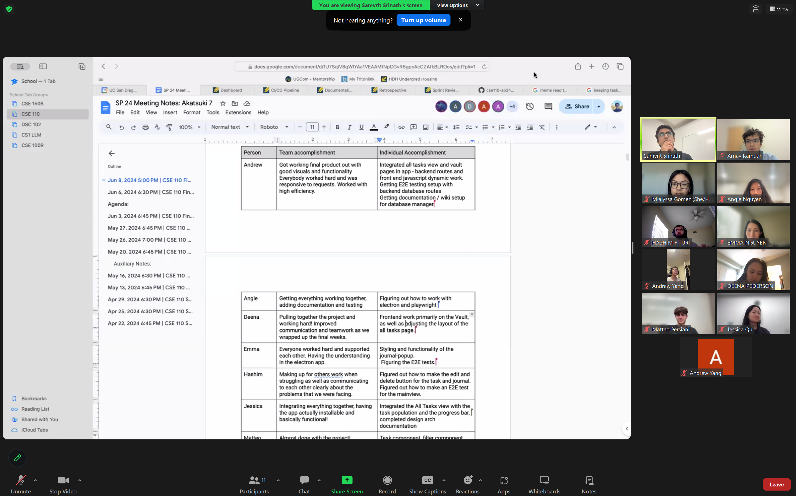
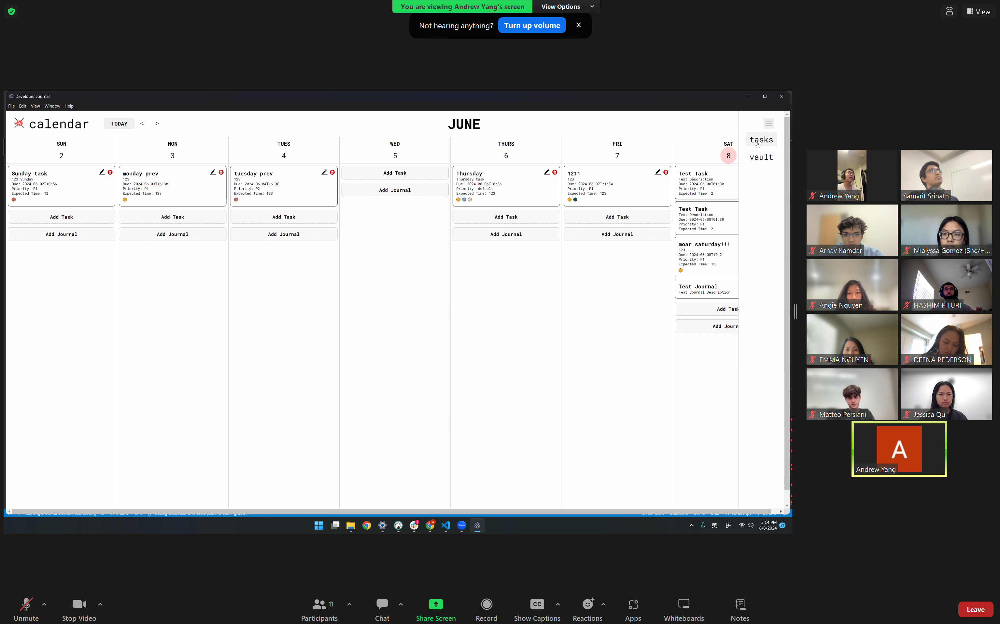
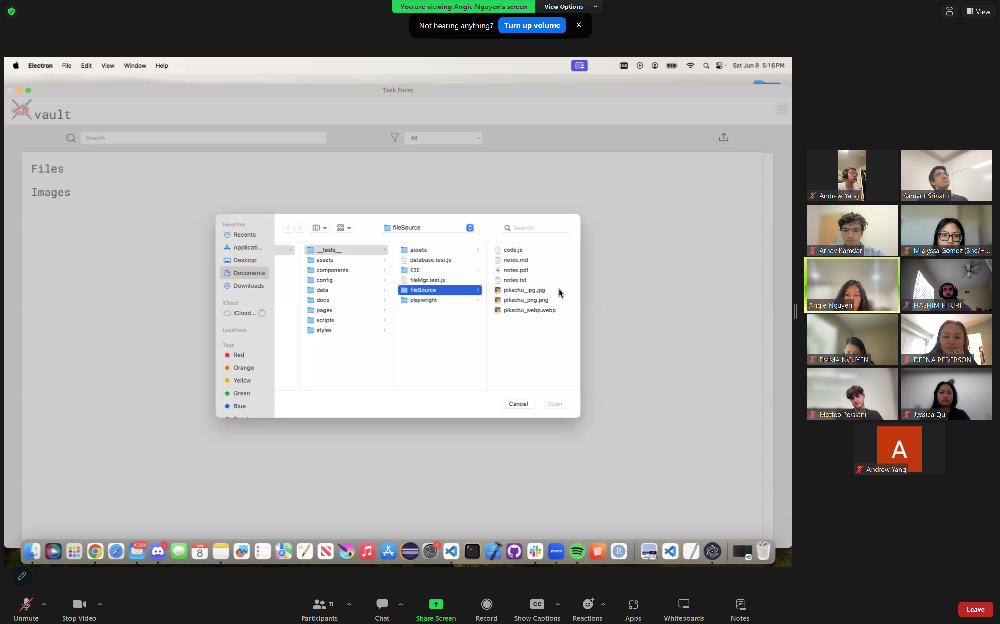
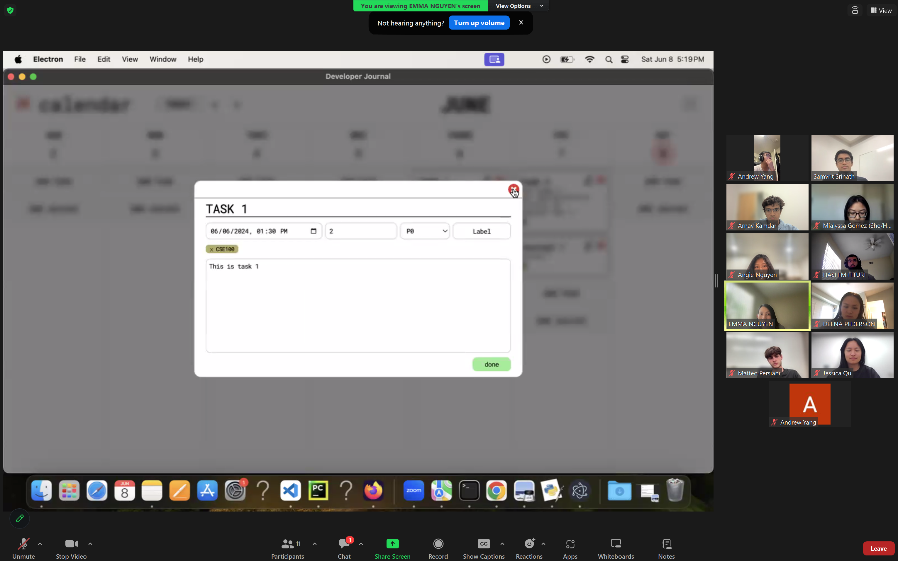
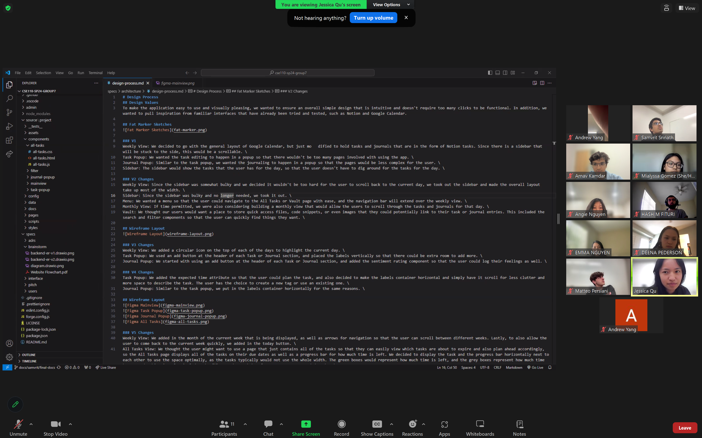
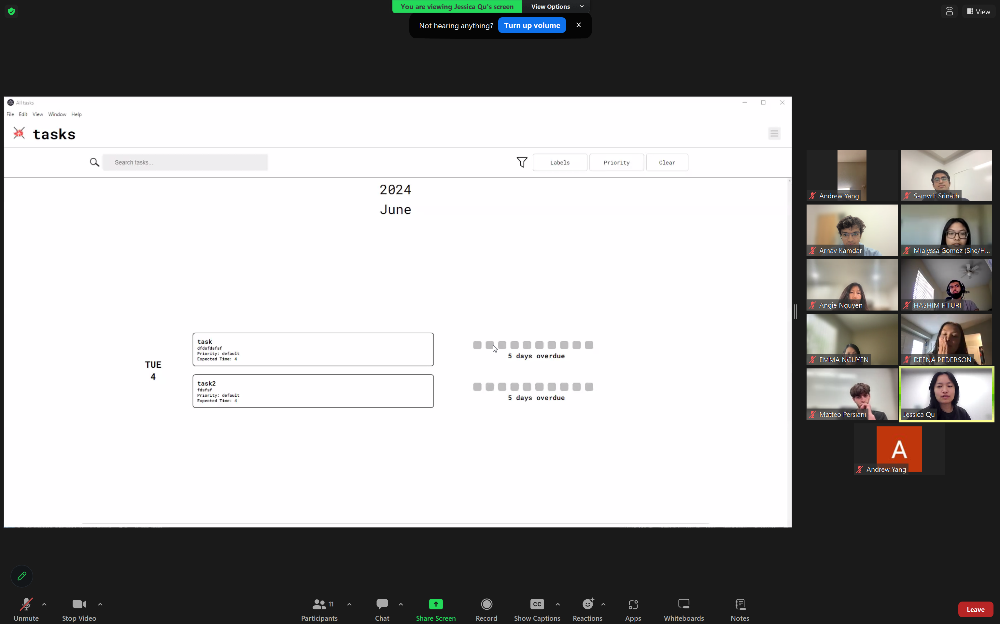
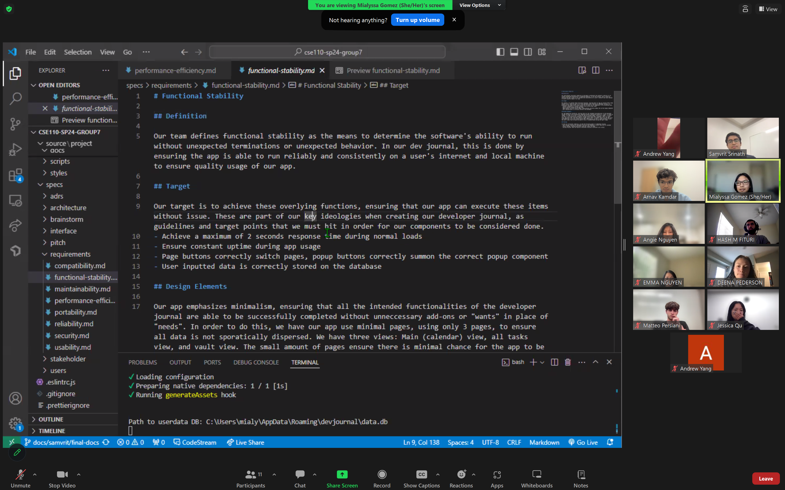
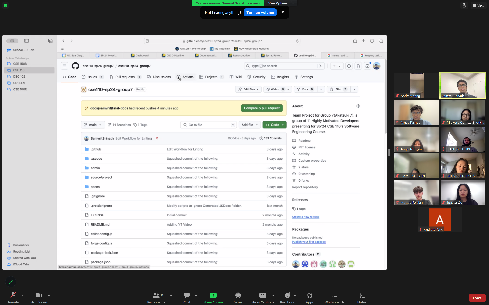

# Sprint 2 Review Meeting

### Attendees:

Arnav, Samvrit, Andrew, Angie, Deena, Emma, Hashim, Jessica, Matteo, Mialyssa, Naina

### Purpose of the Sprint Review

Today's Sprint Review was held to go over the second and final official sprint that our team has had, namely in the formation of the final release of the product for our final project. We held this review because we were interested in knowing what each team member was proud of personally, as well as to note some important group accomplishments. Being part of a team, it is often easy to forget to commend others on their work and focus on accomplishments, as we get lost in the minutiae and deadlines of the work.

### High Points of the Meeting

Following is feedback received from each member of the team, discussed at length in the Sprint Review Meeting:

- **Andrew**:
  - Team accomplishment: Got working final product out with good visuals and functionality. Everybody worked hard and was responsive to requests. Worked with high efficiency.
  - Individual accomplishment: Integrated all tasks view and vault pages in the app - backend routes and front-end JavaScript dynamic work. Set up E2E testing with backend database routes. Set up documentation/wiki for database manager.
- **Angie**:
  - Team accomplishment: Getting everything working together, adding documentation and testing.
  - Individual accomplishment: Figuring out how to work with Electron and Playwright.
- **Deena**:
  - Team accomplishment: Pulling together the project and working hard! Improved communication and teamwork as we wrapped up the final weeks.
  - Individual accomplishment: Frontend work primarily on the Vault, as well as adjusting the layout of the all tasks page.
- **Emma**:
  - Team accomplishment: Everyone worked hard and supported each other. I believe that we were improving in collaboration and helping each other after the integration.
  - Individual accomplishment: Styling and functionality of the journal popup. The icons for edit and delete buttons. Figuring out the E2E tests.
- **Hashim**:
  - Team accomplishment: Making up for others' work when struggling as well as communicating to each other clearly about the problems that we were facing.
  - Individual accomplishment: Figured out how to make the edit and delete button for the task and journal. Figured out how to make an E2E test for the main view. Also refactored the README.md.
- **Jessica**:
  - Team accomplishment: Integrating everything together, having the app actually installable and basically functional!
  - Individual accomplishment: Integrated the All Tasks view with the task population and the progress bar. Completed design arch documentation.
- **Matteo**:
  - Team accomplishment: Almost done with the project! Developed and tested an app in just a few weeks with people we hadn't worked with before.
  - Individual accomplishment: Task component, filter component, labels for the task and journal popups, helped with vault frontend stuff and styling of various items, dev docs, search functionalities for all tasks and vault.
- **Mialyssa**:
  - Team accomplishment: We are pulling through!! The project is coming together nicely and would not have been possible without everyone’s work.
  - Individual accomplishment: Frontend work: main view weekly navigation, stylistic enhancement, all tasks view assisting with integration, -ilities and page views documentation.
- **Naina**:
  - Team accomplishment: The final project is almost complete and everyone worked so hard and put so much effort in to make it happen. The product looks great! Overall, our communication and hard work paid off.
  - Individual accomplishment: Working with the design team and doing the frontend work on the display of our calendar and tasks. Focusing on stylization and development of the designs we chose, writing some documentation. Doing a few PRs and helping where I could with others.
- **Arnav**:
  - Team accomplishment: Nearly wrapped up the final product and got a great developer tool completely working. In particular, glad we stuck to all the items in the rubric and have a great blend of features and software engineering practices.
  - Individual accomplishment: Set up Playwright for E2E tests, managing issues and meetings, and staying synced with developers for the most part. Reviewing PRs, staying on top of repository organization, and (later) filming demo and practices video.
- **Samvrit**:
  - Team accomplishment: Almost done with the project! I believe we have the best project in the entire Akshay Cohort and we have done so much documentation for the project, so great job to everyone.
  - Individual accomplishment: Automation/JSDocs Pipeline, getting ESLint working this morning, having the Wiki fully set up! Leading the team through the hardest portions of the project. Reviewing PRs and everything else, getting the final video set up.

### Overall Takeaways

The Sprint Review Meeting provided a comprehensive overview of the team's accomplishments and individual achievements during the sprint. Specifically, we highlight the team's **cohesion**, with all developers working as a team and picking up after one another. As always, the team's **quick thinking** was highlighted in the limited timeframe. However, one notable improvement from previous sprints is a much stronger emphasis on **clear communication**, **time management**, and **great work distribution**. Several developers mentioned that they are proud of the team pulling through in the final stretch of the product and getting the tool working. This emphasizes to us the importance of **accountability** and **responsibility**.

### Screenshots from Sprint Review:

