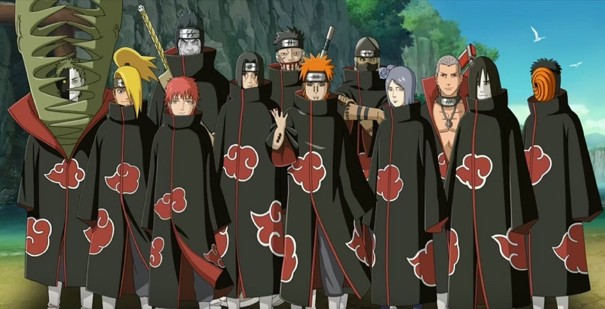
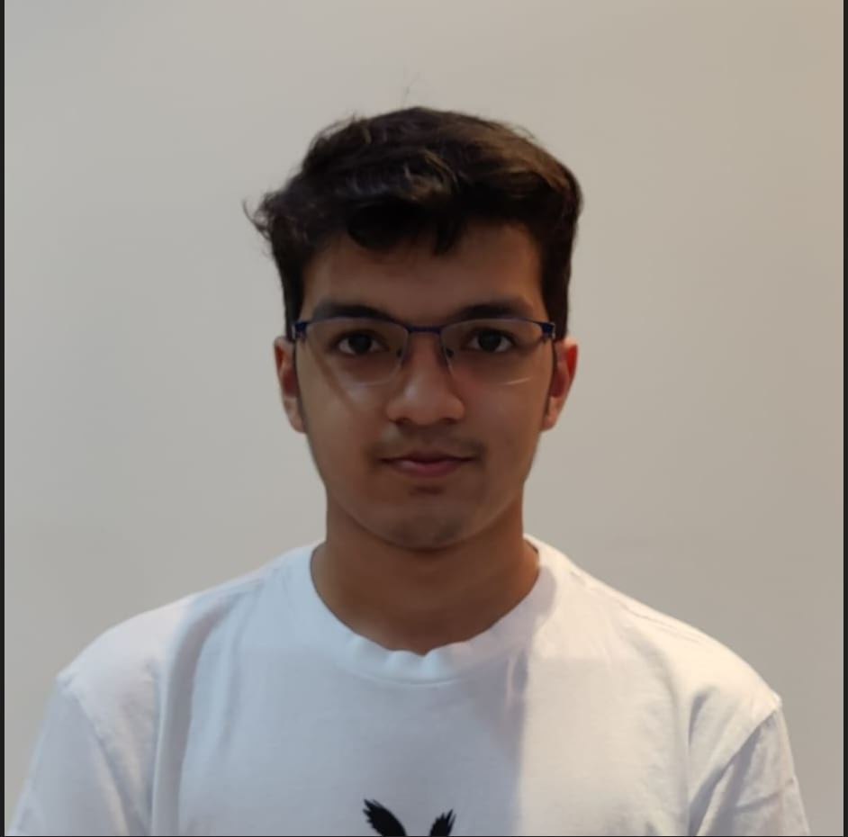
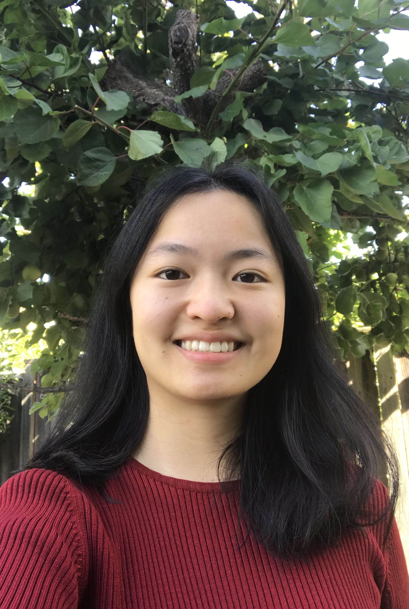
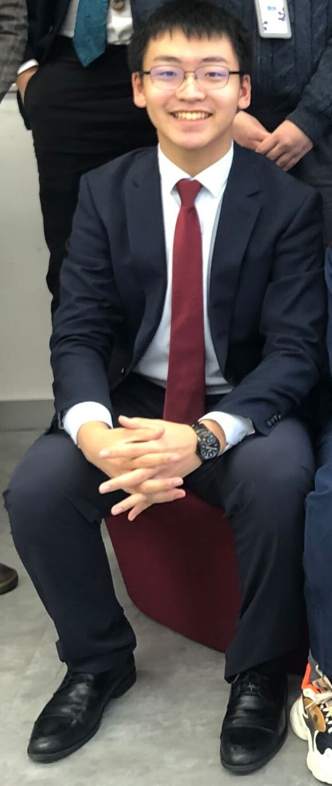
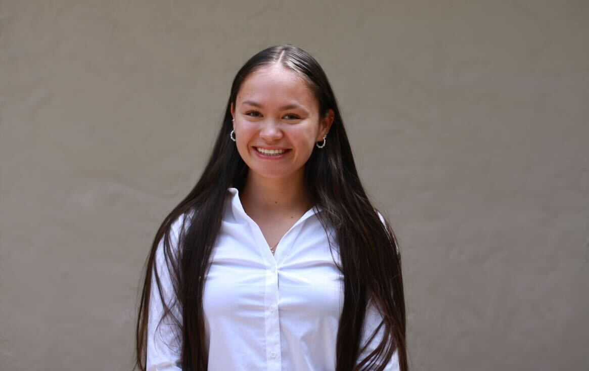
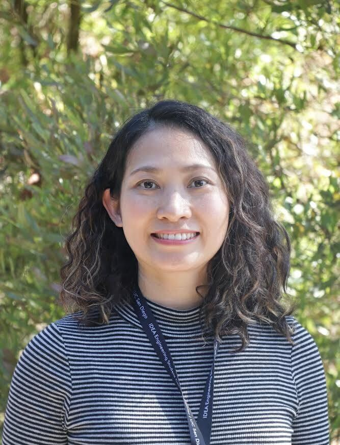
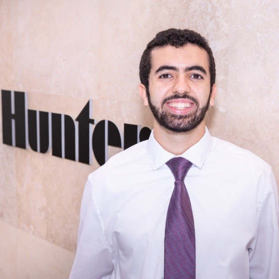
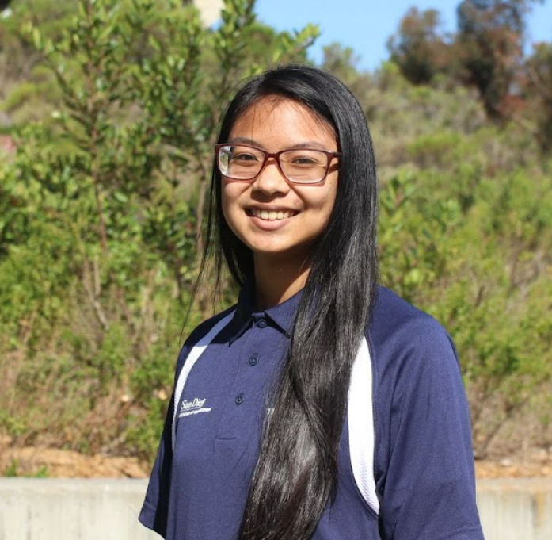
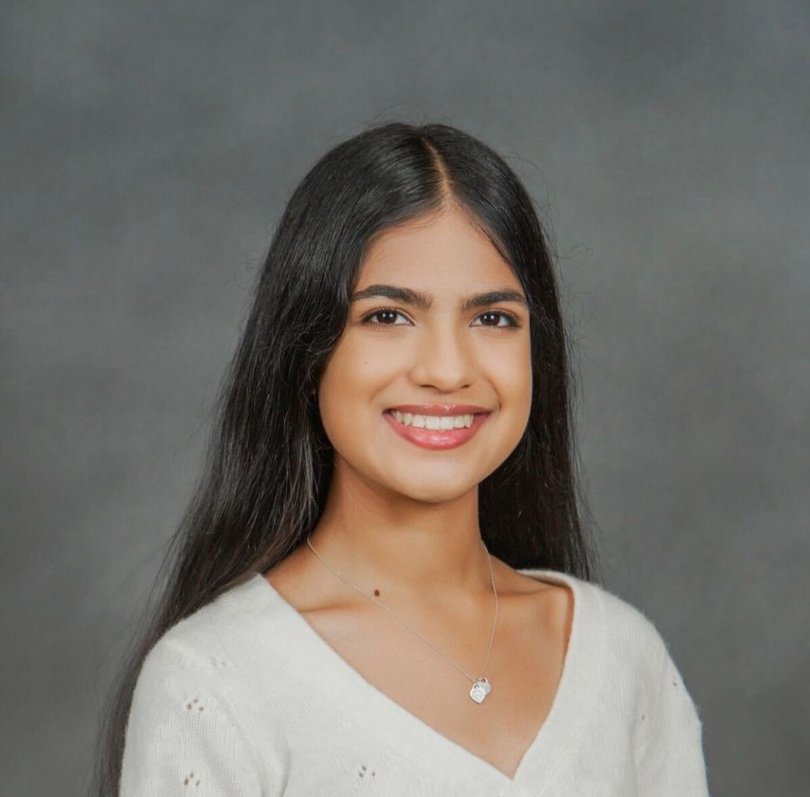

# Akatsuki 7 - CSE 110 Spring '24

    

## Team Introduction

Welcome to the Akatsuki 7 team page! We are a group of 11 students in CSE 110 Spring '24! Please look forward to our ongoing project and team member Introductions!

### Motivation Behind the Name/Brand

Given our number **Team 7**, we decided to name ourselves after the Akatsuki, a reference from the Anime Show **Naruto**. The Team 7 was derived from the main trio of the group, Naruto, Sakura and Sasuke were all members of Team 7(led by Kakashi). Humorously, we have learned more about Naruto in the last two days than we have in our entire lives. As such, many of the branding elements are Ninja-esque and our main color scheme takes after the _Akatsuki_, a group of rogue ninja in the show that are clad in **red,black and white** robes.

### Team Values

-   **Collaboration**: We believe that the best work is done when we work together. We value each other's opinions and ideas and work together to create the best possible solutions.
-   **Inclusivity**: We believe that everyone has a voice and we strive to make sure that everyone is heard.
-   **Dedication**: We are dedicated to our work and strive to put our best foot forward in everything we do.
-   **Shapes**: We place great importance on the value of shapes
-   **Fun**: We believe that we should have fun while working together, and strive to create a fun and inclusive environment for everyone.

## Team Members

### Team Leads

#### Samvrit Srinath

Hi everyone! My name is Samvrit Srinath, and I am a 2nd year computer science Major! I love to play video games (RPGs), cook a variety of cuisines and go hiking! My favorite shape has to be a Hexagon. I don’t know, there’s just something so satisfying about looking at Beehives. I’m looking forward to working in a Team Project and learning about my innate Ninja abilities with the rest of everyone! **Github Page**: <a href="https://samvritsrinath.github.io/CSE110Lab1/">Samvrit's Website</a>

#### Arnav Kamdar

Hey everyone, I'm Arnav Kamdar, a second year computer science major in Muir. Some of my hobbies are wall climbing (you can find me at UCSD's climbing gym every other evening of the week) and hiking! My favorite shape has to be an isosceles triangle because of its balance of symmetry and imperfection - circles and equilateral triangles seem a bit too perfect to me, like they're hiding something. I'm looking forward to getting a much better idea of software engineering (to hopefully help with future internships and jobs) and also to build a strong community with some great budding SEs. **Github Page**: [Arnav's Webpage](https://arnavkamdar.github.io/CSE-110-Lab1/)

### Developers and Designers

#### Jessica Qu - Designer

Hello, my name is Jessica and I’m a 2nd year Math-CS major living in Warren! My hobbies include playing badminton and cooking, as well as trying new restaurants. My favorite shape is probably a triangle because they’re so useful and they were pretty fun in Geometry as well. I’m really looking forward to meeting everyone, working on a project together, and hopefully becoming good friends with y’all! My **Github Page**: [Jessica's Webpage](https://github.com/qujessica2048/JessicaUserPage)

#### Andrew Yang - Developer

Hi everyone, my name is Andrew Yang, and I am a second year CS major in Warren. I enjoy playing video games, and playing ping pong. As for my favorite shape, I like cylinders because they are the basis for beautiful pillars in many cool architecture. I'm looking forward to working everyone and contribute to the project! **Github Page**: [Andrew Webpage](https://andronius-yang.github.io/cse110lab1/)

#### Angie Nguyen - Developer

Hi everyone, my name is Angie Nguyen and I’m a third year CS major in Muir. In my free time I like to play videogames and surf. My favorite shape would probably be circles also for no particular reason. I look forward to working with you guys on the project and getting more practice with web development along the way! **Github Page**: [Angie's Webpage](https://angie-n.github.io/CSE110/)

#### Deena Penderson - Developer

Hi everyone! My name is Deena Pederson and I am a 4th year Math-CS major in Muir. I compete on the softball team here at UCSD which ends up occupying a significant amount of my free time, but besides that I love going to the beach and cooking. I would say my favorite shape is a triangle for no particular reason. I am looking forward to working as a team and hopefully have some fun while building our project! **Github Page**: [Deena's Webpage](https://deenap23.github.io/PagesProject/)

#### Emma Nguyen - Developer

Hi, my name is Emma Nguyen. I am a 3rd year computer science major. My hobbies are about sports and music. I like playing ping pong and listening to music. My favorite instrument is piano. I don't really have a favorite shape, but I would be more interested in a rectangle. Because it is symmetric but not too perfect, which allows me to arrange them in various ways, and construct an array of diverse shapes from rectangular blocks. I am looking forward to working with our team in CSE110. My **Github Page**: [Emma's Webpage](https://faquanly.github.io/SP24-MyPage/)

#### Hashim Fituri - Developer

Hi everyone, my name is Hashim Fituri and I'm a third year computer engineering major in Sixth. I like to fish, work out, play basketball, and play videogames in my free time. My favorite shape would be a square because I see a lot of squares in my daily life. I'm looking forward to getting a more in depth understanding of SWE and hopefully collaborate together on our project. **Github Page**: [Hashim Webpage](https://hfituri.github.io/CSE110/)

#### Matteo Persiani - Developer

Hi all, I’m Matteo Persiani, a second year computer engineering major in Revelle. My hobbies include soccer, rock climbing, traveling, snowboarding, and some water sports. I’ve never thought about my favorite shape but the first one that comes to mind is an octagon. I’m hoping to get some experience working on a team for projects as well as learning whatever else the class offers. **Github Page**: [Matteo's Webpage](https://github.com/mapersiani/MyUserPage)

#### Mialyssa Gomez - Developer

Hello everyone! My name is Mialyssa Gomez, I am a 3rd year Computer Engineering major in Muir. Some of my hobbies include playing video games (console), wood arts and crafts, and I recently got a guitar! Im a slow learner, but im having fun! My favorite shape would have to be a star because look at it :point_right: :star: isnt it just the coolest shape? Im looking forward to getting some SE and project team experience with you all, and to have lots of fun! **Github Page**: [Mialyssa's Webpage](https://mialyssa.github.io/cse-110/)

#### Naina Singh - Developer

Hi guys! I’m Naina Singh. Naina is pronounced like the nana in banana! I am a second year CS major in Muir college. Some of my hobbies are sketching and painting, recently I’ve been building some lego sets, I love to go hiking / exploring, I’m a huge foodie so trying new places is always fun, and I am starting to cook and bake more. My favorite shape is a heart 🩷 because it’s pretty and makes for nice decoration. I look forward to getting the experience of working with a team and building a project! I hope that I can take away aspects of the class and use it in my future career / endeavors. I also look forward to making friends with all of you and being able to have fun while making something great! **Github Page**: [Naina's Webpage](https://n2singh.github.io/cse110-Lab1/)

