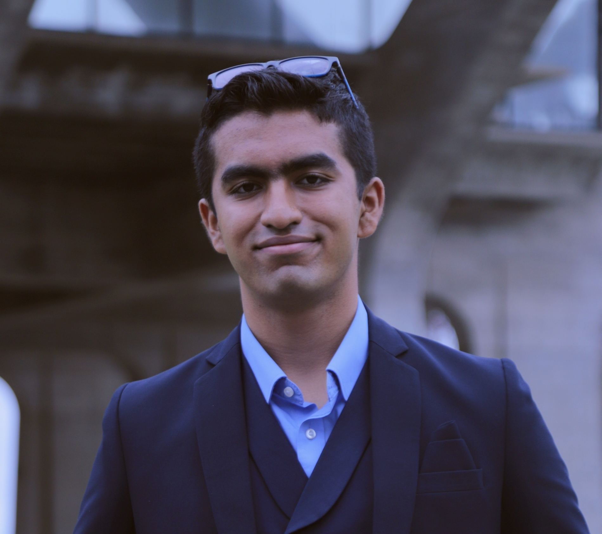

# Akatsuki 7 - CSE 110 Spring '24

  

## Team Introduction

Welcome to the Akatsuki 7 team page! We are a group of 11 students in CSE 110 Spring '24! Please look forward to our ongoing project and team member Introductions!

### Motivation Behind the Name

Given our number **Team 7**, we decided to name ourselves after the Akatsuki, a reference from the Anime Show **Naruto**. The Team 7 was derived from the main trio of the group, Naruto, Sakura and Sasuke were all members of Team 7(led by Kakashi). Humorously, we have learned more about Naruto in the last two days than we have in our entire lives. As such, many of the branding elements are Ninja-esque and our main color scheme takes after the _Akatsuki_, a group of rogue ninja in the show that are clad in red,black and white robes.

### Team Values

-   **Collaboration**: We believe that the best work is done when we work together. We value each other's opinions and ideas and work together to create the best possible solutions.
-   **Inclusivity**: We believe that everyone has a voice and we strive to make sure that everyone is heard.
-   **Dedication**: We are dedicated to our work and strive to put our best foot forward in everything we do.
-   **Shapes**: We place great importance on the value of shapes
-   **Fun**: We believe that we should have fun while working together, and strive to create a fun and inclusive environment for everyone.

## Team Members

### Team Leads

#### Samvrit Srinath

Hi everyone! My name is Samvrit Srinath, and I am a 2nd year computer science Major! I love to play video games (RPGs), cook a variety of cuisines and go hiking! My favorite shape has to be a Hexagon. I don’t know, there’s just something so satisfying about looking at Beehives. I’m looking forward to working in a Team Project and learning about my innate Ninja abilities with the rest of everyone! Github Page: <a href="https://samvritsrinath.github.io/CSE110Lab1/">Samvrit's Website</a>

#### Arnav Kamdar

Hey everyone, I'm Arnav Kamdar, a second year computer science major in Muir. Some of my hobbies are wall climbing (you can find me at UCSD's climbing gym every other evening of the week) and hiking! My favorite shape has to be an isosceles triangle because of its balance of symmetry and imperfection - circles and equilateral triangles seem a bit too perfect to me, like they're hiding something. I'm looking forward to getting a much better idea of software engineering (to hopefully help with future internships and jobs) and also to build a strong community with some great budding SEs.
Github page: 

#### Developers and Designers

#### Jessica Qu - Designer

Hello, my name is Jessica and I’m a 2nd year Math-CS major living in Warren! My hobbies include playing badminton and cooking, as well as trying new restaurants. My favorite shape is probably a triangle because they’re so useful and they were pretty fun in Geometry as well. I’m really looking forward to meeting everyone, working on a project together, and hopefully becoming good friends with y’all! My GitHub page: [Jessica's Webpage](https://github.com/qujessica2048/JessicaUserPage)

