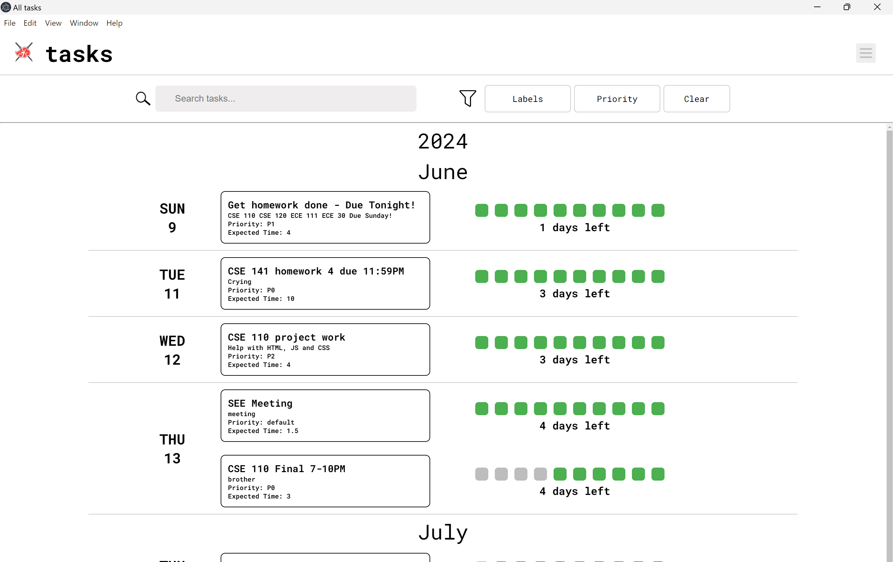
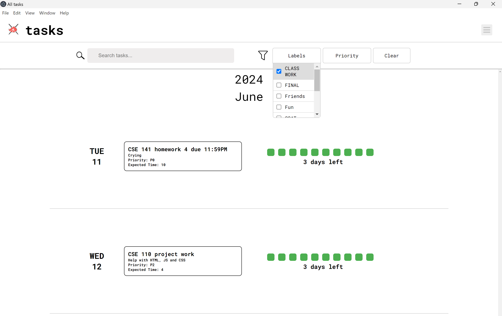
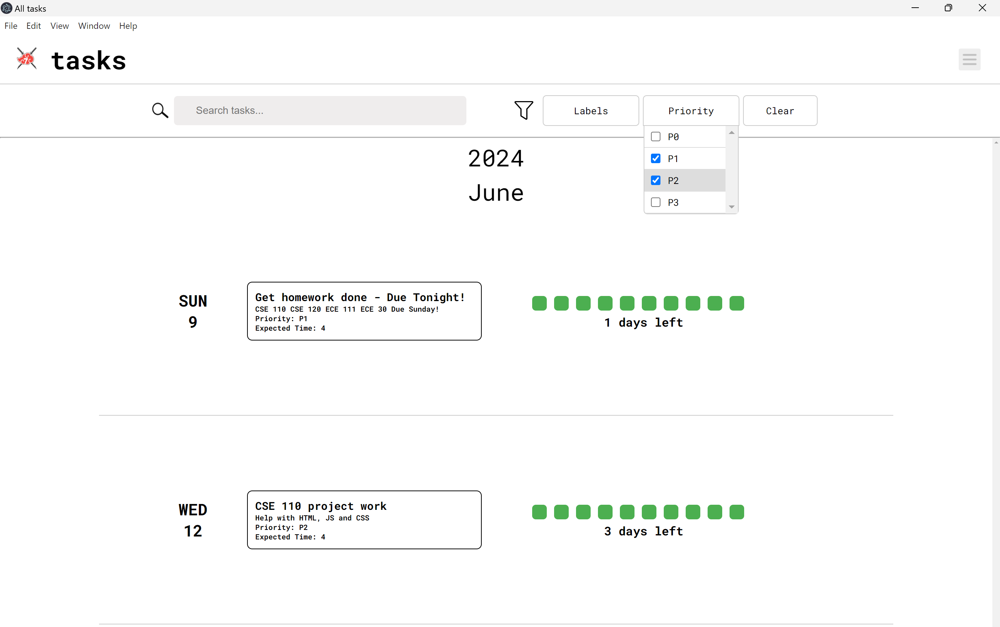

# Documentation For Mainview

## Role of Mainview

The role of this page is to be the host of a list view of all of the user's tasks for the Akatsuki 7 Developer Journal. 

## Intended Purpose

The all tasks page is intended to be a list view for all of the user's tasks that they have created which can be filtered by either their label or their priority. This makes it easier for the user to sort through their tasks by using the associated filters  

## Implementation/Syntax Approaches?

This all tasks view was implemented in several iterations, beginning with a static HTML page with similar styling to the mainview page to encourage consistency. We began with static hardcoded tasks to test the layout of the all tasks view. After the backend was integrated correctly, the iterations that followed were to correct styling.

## Requirements

The All Tasks View is operable once it is opened from one of the pages via clicking the menu button in the top right corner of the screen. Once the page is opened, it will operate as long as the page is open. The data is saved to your local storage.

## Testing

For testing the all tasks view, we used LiveServer to check the stylistic changes and baasic functionality that were made to the page that did not require any database elements. Once we added the functionality of local storage and the database, we used electronJS to test how these implementations integrated into the all tasks view. Further Stylization and JavaScript continuity was tested with Prettier, ESLint, and Jest during pull requests and merges.

#### Authors

- Mialyssa Gomez