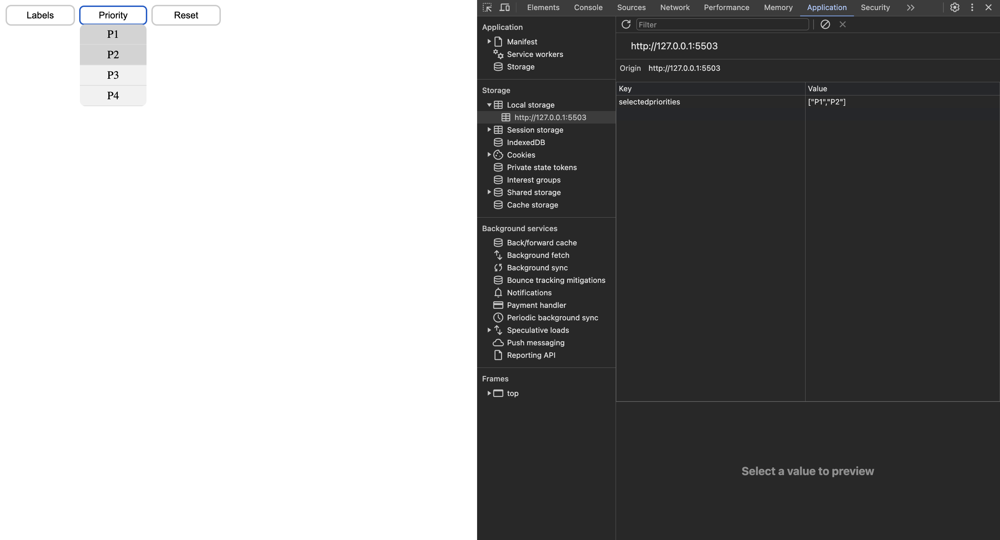

# Documentation For Filter Component

## Role of Filter Component

The `Filter Component` is a custom web component that allows users to filter tasks based on their properties. It will provide a user-friendly interface for selecting filter criteria and dynamically displaying relevant tasks.

## Intended Purpose

The primary purpose of the `FilterComponent` is to simplify the process of filtering tasks by various criteria such as labels, expected time, priority, and due date. It helps users to quickly narrow down their list of tasks and focus on the most relevant ones.

## Implementation/Syntax Approaches

To use the `FilterComponent`, include it in your HTML as follows:

```html
<filter-component></filter-component>
<script src="./filter.js"></script>
```

## Requirements

The filter should allow the user to:
- Select multiple filter criteria from a dropdown.
- Filter tasks by labels, and priority.
- Dynamically show or hide tasks based on the selected filter criteria.
- Populate the dropdown with labels retrieved from local storage.
- Provide a user-friendly interface for interacting with the filter options.

## Testing

Testing was performed with LiveServer. The filter has not been tested with tasks but does properly load the labels from local storage


#### Authors

- Matteo Persiani