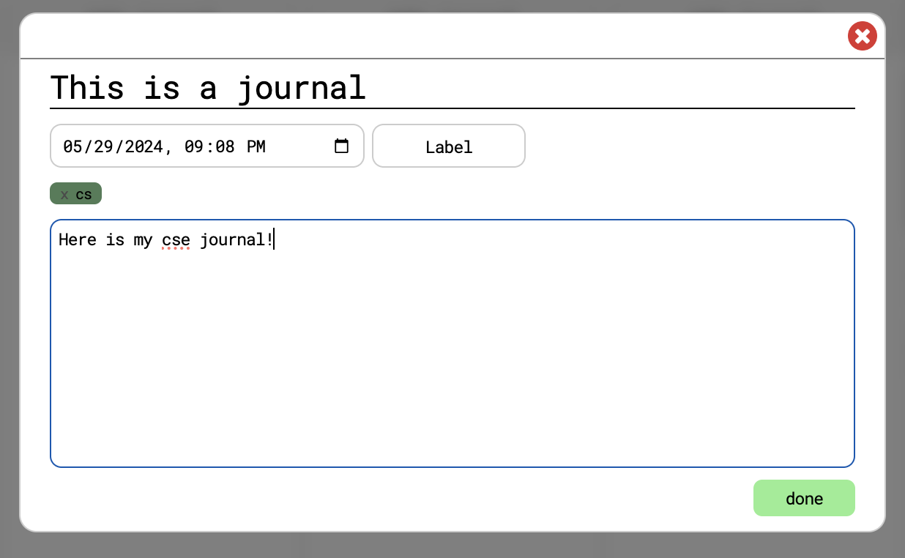

# Documentation For Journal Popup

## Role of Journal Popup

The Journal Popup Component serves as a user interface element designed to facilitate the entry of journal entries by users.

## Intended Purpose

The primary purpose of the Journal Popup Component is to provide users with a convenient and intuitive way to input journal entries. This component appears as a popup window within the web application, prompting users to enter a journal entry. Each journal entry consists of a title, a date, custom label options, and the contents of the journal. The user is intended to fill in these entries at their respective prompts and input boxes where they can then save their journal to the calendar mainview.

## Implementation/Syntax Approaches?

We started out with a loose html structure of our popup, and then moved on to the js and css. We utilized js to render the popup to be an independent custom component so that it could be easily implemented throughout the calendar view. Once we were able to link all the files together and get the basic fuctionality we moved on to styling our popup to mirror the design put out by our team. This was more difficult, as some of the elements were not formatting in the desired layout. At this point, we had to adjust our html structure to be more flexible and at this point we were able to finalize. The last adjustments we made were primarily css styling so that the journal and task popups would be uniform.

The popup can be implemented with the following code: 
```html
<button id="open-journal-popup">Add Journal</button>
<script src="./journal-popup.js"></script>
```
## Requirements

The popup should allow the user to input details for a journal. The background should blur to make the popup the center or attention. Furthermore, the popup should be intuitive and easy to use. Data should be stored locally to be easily accessed by the backend.

## Testing

For testing our popupcomponent, we used the LiveServer to periodically check any changes that were made and the effects of those changes. We also made a separate HTML called index.html purely for testing our code.



#### Authors

- Deena Pederson
- Emma Nguyen
