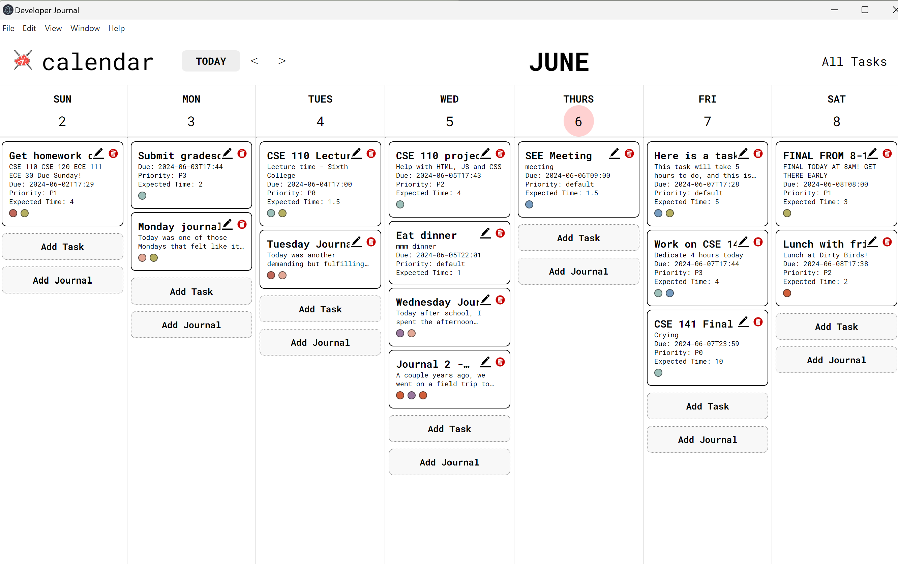

# Documentation For Mainview

## Role of Mainview

The role of this page is to be the host of all of the functionality for the Akatsuki 7 Developer Journal. 

## Intended Purpose

The main page is intended to be a weekly calendar view of any calendar week that displays two different preview features: "Tasks" and "Journals". Each column displays a different day of the week that shows the user's tasks and journal entries they have filled out for that day. 

## Implementation/Syntax Approaches?

This mainview was implemented in several iterations, beginning with a static HTML page with a header with non-functional buttons and simple columns that separate each day container, and stand-in journal and tasks preview containers that would later be filled with the actual user-inputted entries themselves. Once the journal and task popup components were completed, they were added to the functionality of the mainview and connected to the backend. These journal and task components were updated to include the label components that would later be useful for filtering.

## Requirements

The mainview works on app startup, and will operate as long as the app is open. The data is saved to your computer's storage.

## Testing

For testing the mainview, we used LiveServer to check the stylistic changes and baasic functionality that were made to the page that did not require any database elements. Once we added the functionality of local storage and the database, we used electronJS to test how these implementations integrated into the mainview. Further Stylization and JavaScript continuity was tested with Prettier, ESLint, and Jest during pull requests and merges.

#### Authors

- Mialyssa Gomez