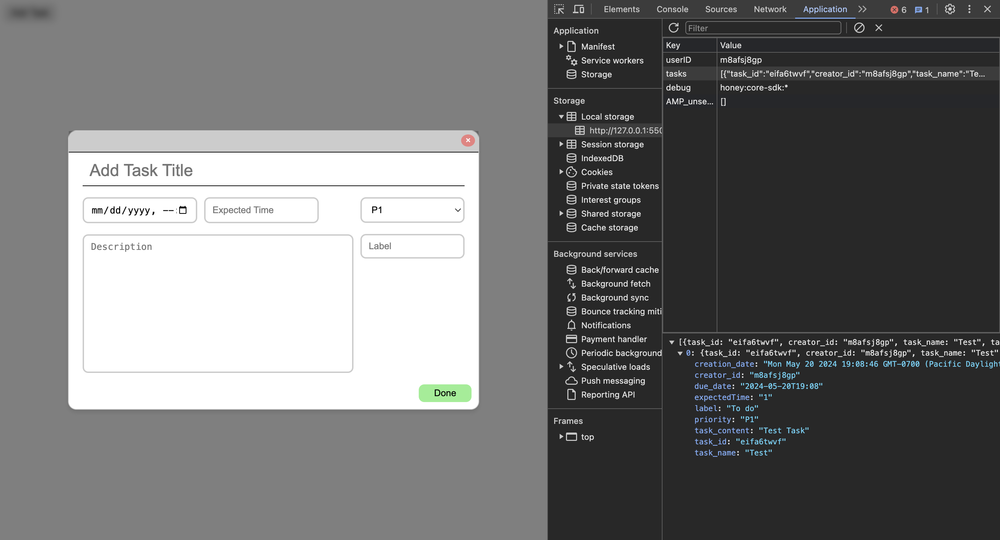

# Documentation For Popup

## Role of Popup

The role of this component is to have a popup feature when someone wants to add a task to their calendar.

## Intended Purpose

The popup is intended to open up when the user wants to create a new task. It will give them the option to imput a title, description, and more. When the user is done, they can click "add" to add the task to their calendar. The user can also exit the popup by clicking anywhere outside of the box.

## Implementation/Syntax Approaches?

On our first try of implementing this component we had a separate HTML, CSS, and JS file but we did most things in our JS file. After we had a working product, we started to slowly move each language into their respective files. We first began with moving our CSS code in our JS file into a CSS file. This took us some time as we had to figure out how to link the CSS file into our JS file. We then moved our HTML component to its respective file which went pretty smoothly. We had to use fetch to get the contents of out HTML file into our JS file. Lastly, we moved a few lines of script that we had in our HTML file by simply cutting it and adding it to the bottom of the JS file.

The popup can be implementing with the following code:

```
<button id="open-popup">Add Task</button>
<script src="popup-component.js"></script>
```

## Requirements

The popup should allow the user to input details for a task. The background should blur to make the popup the center or attention. Furthermore, the popup should be intuitive and easy to use.

## Testing

For testing our popupcomponent, we used the LiveServer to periodically check any changes that were made and the effects of those changes. We also made a separate HTML called index.html purely for testing our code.



#### Authors

- Hashim Fituri
- Matteo Persiani
