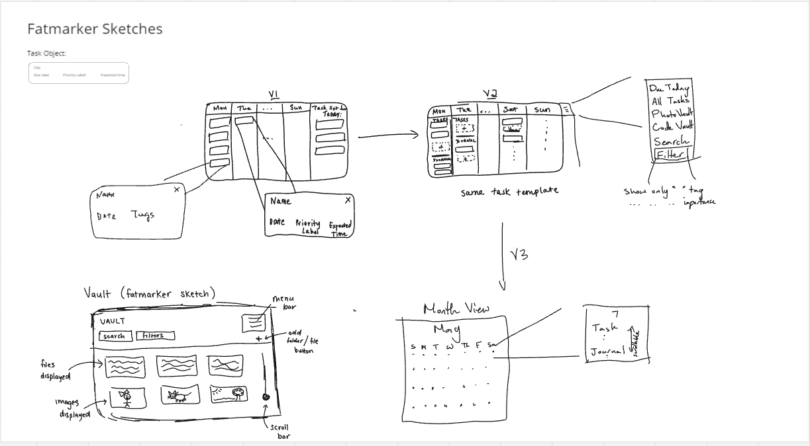
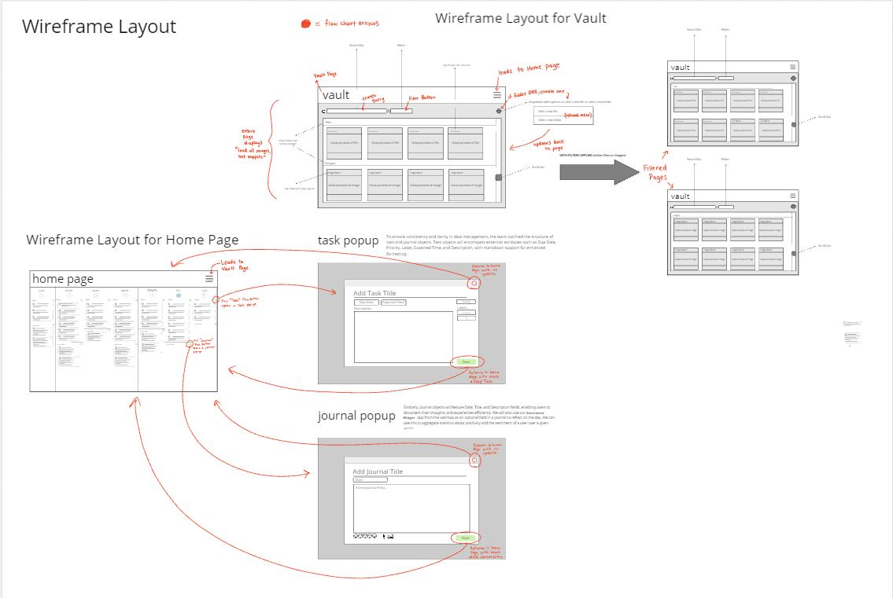
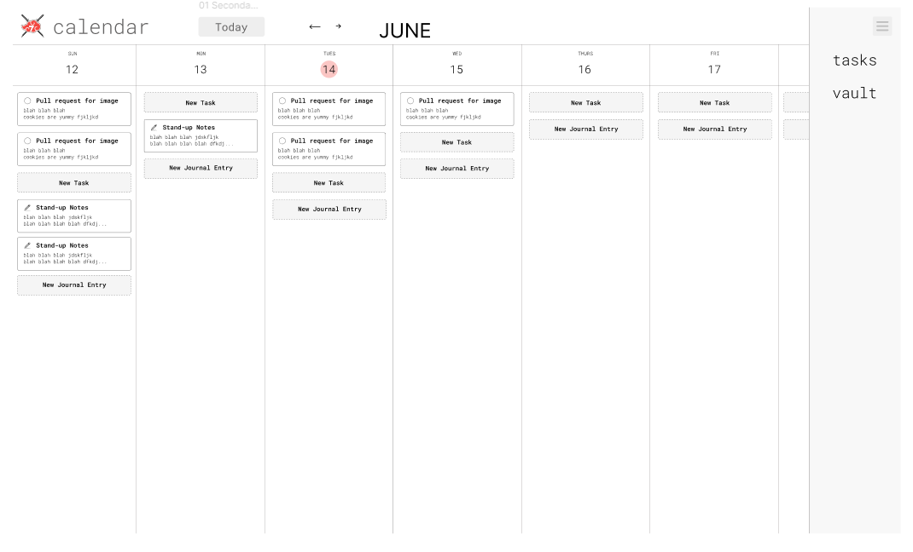
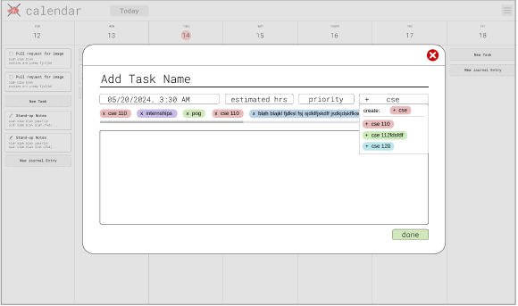
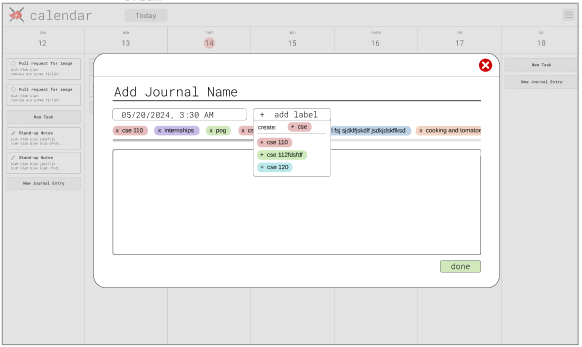
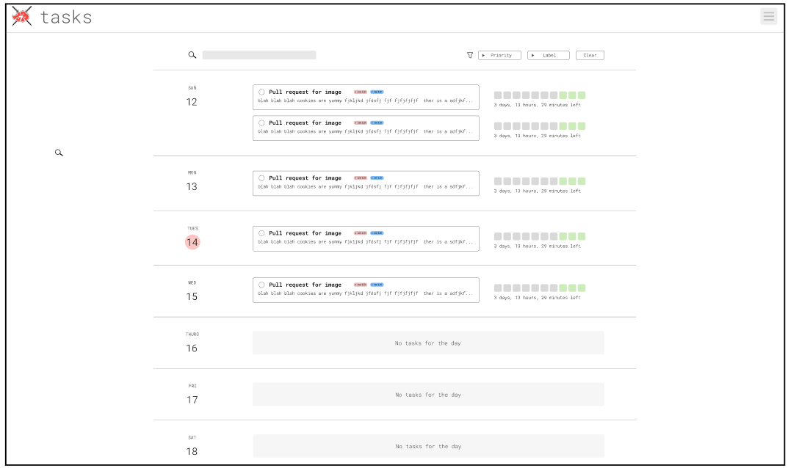

# Design Process

## Design Values

To make the application easy to use and visually pleasing, we wanted to ensure an overall simple design that is intuitive and doesn't require too many clicks to be functional. In addition, we wanted to pull inspiration from familiar interfaces that have already been tried and tested, such as Notion and Google Calendar.

## Fat Marker Sketches

### V1

Weekly View: We decided to go with the general layout of Google Calendar, but just mo dified to hold tasks and journals that are in the form of Notion tasks. Since there is a sidebar that will be stuck to the side, this would be a scrollable. \
Task Popup: We wanted the task editing to happen in a popup so that there wouldn't be too many pages involved with using the app. \
Journal Popup: Similar to the task popup, we wanted the journaling to happen in a popup so that the pages would be less complex for the user. \
Sidebar: The sidebar would show the tasks that the user has for the day, so that the user doesn't have to dig around for the tasks for the day. \

### V2 Changes

Weekly View: Since the sidebar was somewhat bulky and we decided it wouldn't be too hard for the user to scroll back to the current day, we took out the sidebar and made the overall layout take up most of the width. \
Sidebar: Since the sidebar was bulky and no longer needed, we took it out. \
Menu: We wanted a menu so that the user could navigate to the All Tasks or Vault page with ease, and the navigation bar will extend over the weekly view. \
Monthly View: If time permitted, we were also considering building a monthly view that would allow the users to scroll through the tasks and journals for that day. \
Vault: We thought our users would want a place to store quick access files, code snippets, or even images that they could potentially link to their task or journal entries. This included the search and filter components so that the user can quickly find things they want. \

## Wireframe Layout

### V3 Changes

Weekly View: We added a circular icon on the top of each of the days to highlight the current day. \
Task Popup: We used an add button at the header of each Task or Journal section, and placed the labels vertically so that there could be extra room to add more. \
Journal Popup: We started with using an add button at the header of each Task or Journal section, and added the sentiment rating component so that the user could log their feelings as well. \

### V4 Changes

Task Popup: We added the expected time attribute so that the user could plan the task, and also decided to make the labels container horizontal and simply have it scroll for less clutter and more space to describe the task. The user has the choice to create a new tag or use an existing one. \
Journal Popup: Similar to the task popup, we put in the labels container horizontally for the same reasons. \

## Wireframe Layout

### V5 Changes

Weekly View: We added in the month of the current week that is being displayed, as well as arrows for navigation so that the user can scroll between different weeks. Lastly, to also allow the user to come back to the current week quickly, we added in the today button. \
All Tasks View: We thought the user might want to use a page that just contains all of the tasks so that they can easily view which tasks are about to expire and also plan ahead accordingly, so the All Tasks page displays all of the tasks on their due dates as well as a progress bar for how much time is left. We decided to display the task and the progress bar horizontally next to each other to use the space optimally, as the tasks typically would not use the whole width. The green boxes would represent how much time is left, and the grey boxes represent how much time has passed. This view also includes the filter and search bar for easy access to needed tasks. \
