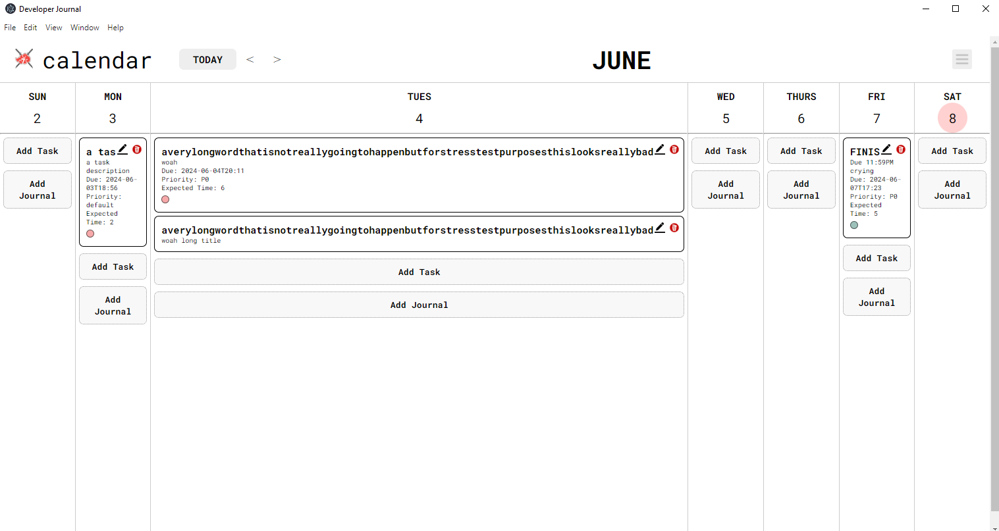
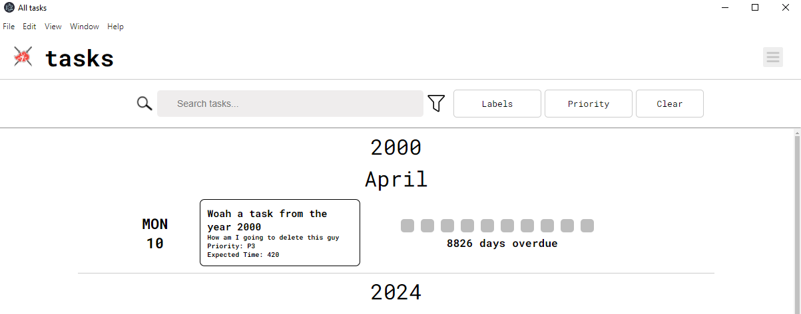
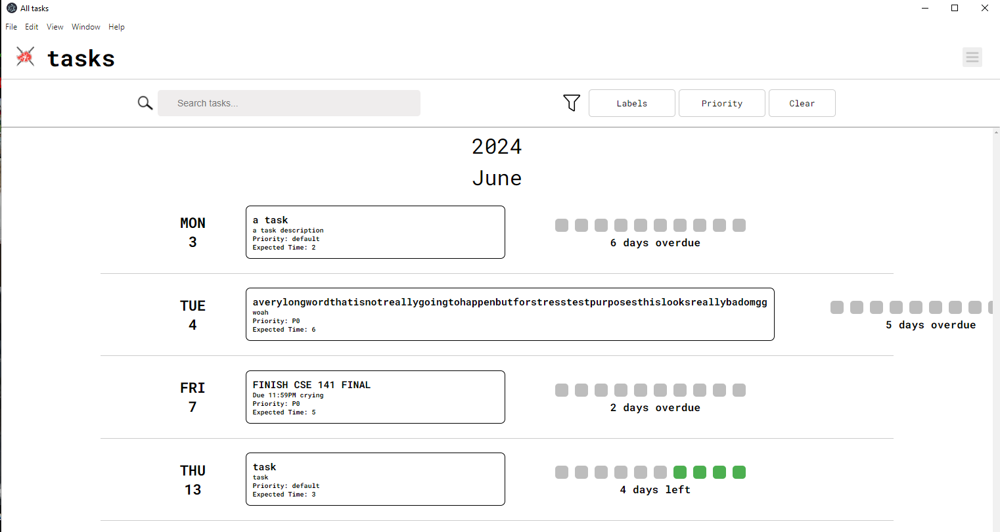
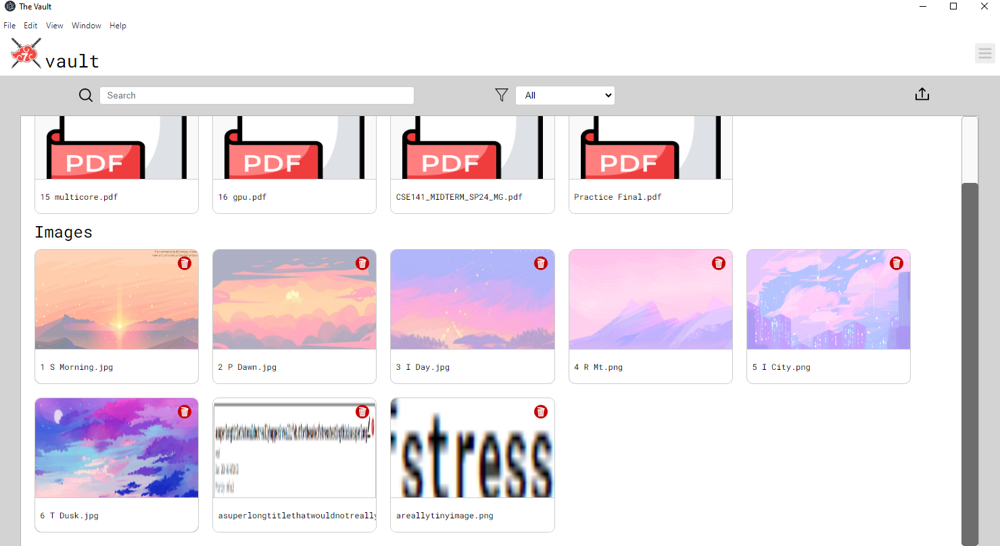

# Dogfooding Reflection

## Overall Experience

As a user, using the Akatsuki 7 Dev Journal app has been a good experience. I think the strongest points of this app is the simplicity in it's functionality, as everything is very clear and concise in what it wants to accomplish. There is no confusion for what any button, title, or label is supposed to achieve, as they are very clear and understandable. I find that the icons make it very helpful when navigating the app, as they are very indicative of the operation that they are useful for.

As a developer, I can see that the app has some issues that have the potential to be ironed out. Mainly when it comes to stress testing and extraneous inputs that are not entirely reasonable, but stress tests nonetheless.

## Calendar Page

### Good Qualities
As intended, I am able to add task entries and journal entries to the app, edit them when needed, and be deleted when I am done with them. I am able to navigate through each week with ease. The menu button is clear and fast, taking me to where I want to go with no delay or performance issues. When I hover over the buttons, they change colors, which helps indicate whether the app responds or not.

The popups for the journal entries and task entries are very clear and concise, giving lots of information and freedom for what I want to incorporate into my entries. 

### Fixable issues
1. The main view has very minimal color, the only colors being the "Today" indicator and the label icons. Other than that, it is a bit bland to look at, as there is mainly text.
2.  Overall a static app, very minimalist. Same comments as above.

### Annoying issues 
1. Using the menu, the page titles jump around depending on what page you are looking at, so there is not much consistency in the menu between pages. There should be 3 pages in the menu at all times to ensure consistency.
2. There should be a separation between the journal entries and task entries in the column view, they are very similar to eachother and hard to tell them apart.
3. Using the popups, when I add a task or journal on a specific date, the calendar in the popup does not reflect the date I chose. I have to scroll again to the date I want in order to input the correct date.

### Major issues
1. If I create a task with a word longer than the size of the column, there is no cutoff for that word, and makes the column very large compared to the initial size.

## All-Tasks Page

### Good Qualities
Having an alltasks view is very helpful in locating all my tasks, without confusing them with journal entries. The addition of the "Days Left" progress bar is very helpful in denoting when a task is close to being due. Having the tasks be able to be sorted by the labels or priority is very useful. The filters for every label and priority allow for the user to have as much freedom to their sorting as possible.

### Fixable issues
1. The styling of the title is different than the styling of the calendar and vault titles, there is a lack of consistency there.
2. The logo is also inconsistent in size, changing when I change pages.

### Annoying issues 
1. I believe tasks should be editable and deletable from the task view, as it is hard to locate an overdue task I want to delete once I no longer want it, and I do not want to scroll back to the actual date it was due on.

### Major issues
1. Similar to the calendar view, if a word in the task title is too long, it will run off the page.

## Vault Page

### Good Qualities
The vault has very straightforward functionality and a great addition to the dev journal. The display is very user-friendly, as the images of the file and image previews are large and easy to read. The search and filter functions allow for an easier time to recollect the wanted files.

### Fixable issues
1. The styling of the title is different than the styling of the calendar and all tasks titles, there is a lack of consistency there.
2. The logo is also inconsistent in size, changing when I change pages.

### Annoying issues 
1. The image previews shrink the image to fit the container, making wider or longer images distorted, and smaller images pixelated. 

### Major issues
1. No major issues are present in this page.